# Wincaja puente de conexión POS

  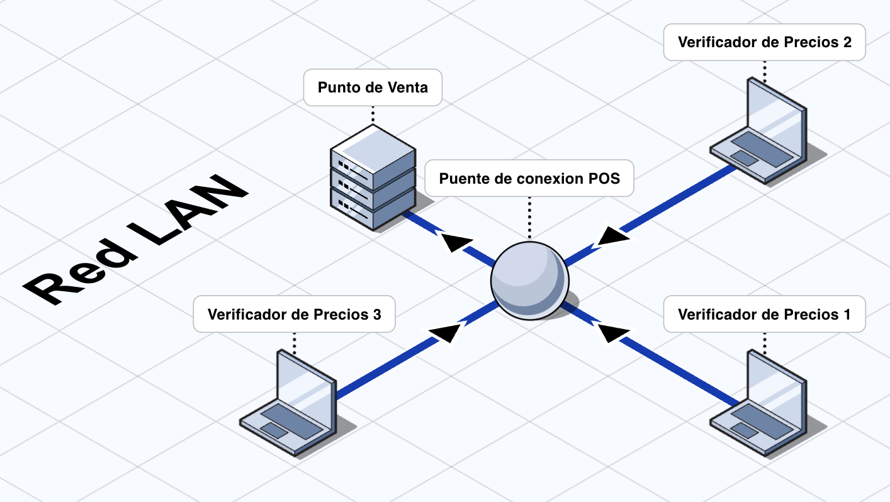

## Introducción

`Wincaja puente de conexión POS` es una aplicación de escritorio que permite conectar nuestro `Verificador de Precios` con el punto de venta `Wincaja®`.

  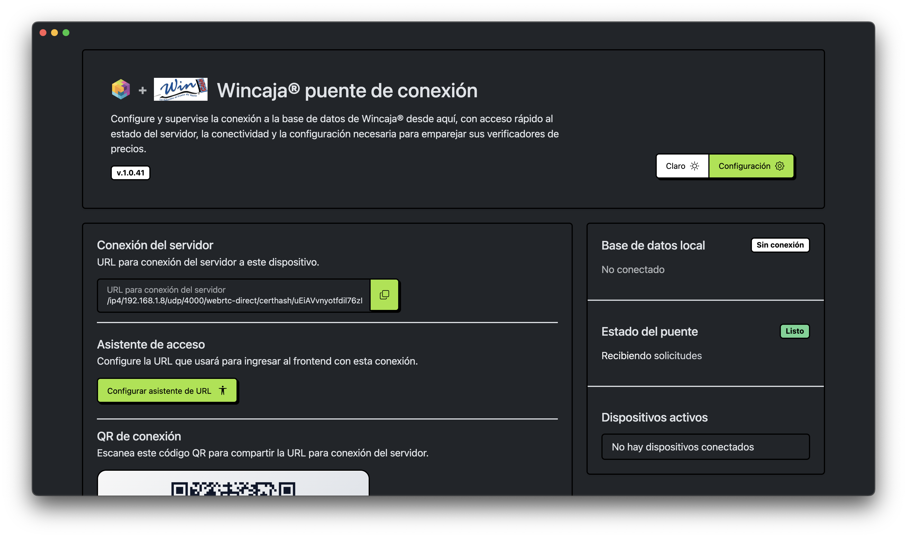

## Compatibilidad con sistemas operativos

La aplicación es compatible con los siguientes sistemas operativos:

| Sistema operativo | Compatibilidad |
| --- | --- |
| Windows | ✅ |
| macOS | ✅ |
| Linux | ✅ |

### Requisitos mínimos del sistema operativo

Para esta versión de la aplicación, se recomienda usar como mínimo:

| Plataforma | Recomendado |
| --- | --- |
| Windows | Windows 10 |
| macOS | macOS 12 Monterey |
| Linux | Distribución moderna de escritorio compatible con Chromium/Electron |

<!-- Importante:

- `Windows 7`, `Windows 8` y `Windows 8.1` no son compatibles con esta versión.
- En Linux, se recomienda usar una distribución actualizada y con soporte vigente. -->

## Comatibilidad con punto de venta `Wincaja®`

- `Wincaja®` versión 10

## Descarga segura

Antes de instalar la aplicación, tenga en cuenta lo siguiente:

- `Wincaja puente de conexión POS` es software legítimo y distribuido de forma oficial a través de [nuestro repositorio de Github](https://github.com/verificador-precios).
- La aplicación se construye y empaqueta siguiendo prácticas orientadas a la seguridad y a la integridad del software distribuido.
- Descargue el instalador únicamente desde el sitio oficial o desde el repositorio oficial del proyecto.
- No instale archivos descargados desde enlaces de terceros, servicios no oficiales o sitios no verificados.

## Instalación

Importante:

Para que la aplicación funcione correctamente, es necesario aceptar el permiso de `conexiones entrantes` cuando el sistema operativo lo solicite.

### Instalación en Windows

1. Descargue [la ultima version del instalador](https://github.com/verificador-precios/puente-de-conexion-pos-wincaja/releases/latest).
2. Abra el archivo descargado.
3. Siga los pasos del asistente de instalación.
4. Al finalizar, abra `Wincaja puente de conexión POS`.

  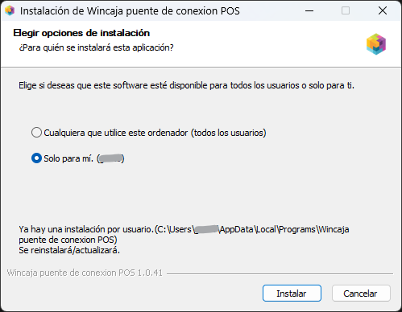

### Si Windows bloquea el instalador o la aplicación

En algunos equipos, Windows puede mostrar advertencias de seguridad al abrir el instalador o la aplicación. Si esto ocurre, puede usar cualquiera de los siguientes métodos.

#### Método 1: Desbloquear desde Propiedades

1. Haga clic derecho sobre el archivo descargado.
2. Seleccione `Propiedades`.
3. En la pestaña `General`, busque la sección `Seguridad`.
4. Marque la casilla `Desbloquear`.
5. Haga clic en `Aplicar`.
6. Haga clic en `Aceptar`.

  

#### Método 2: Omitir la advertencia de Windows SmartScreen

1. Haga doble clic en el instalador o en la aplicación.
2. Si aparece la pantalla `Windows protegió su PC`, haga clic en `Más información`.
3. Después, haga clic en `Ejecutar de todas formas`.

  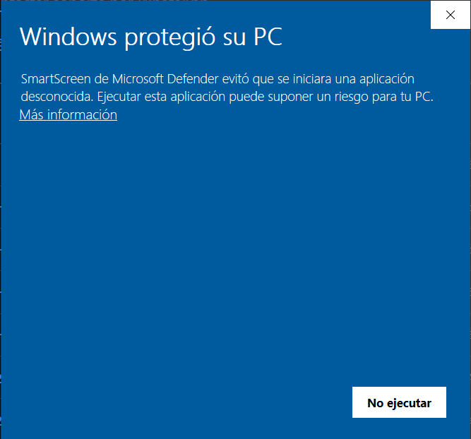

### Permitir conexiones entrantes en el firewall de Windows

Después de instalar y abrir la aplicación, Windows puede mostrar una alerta del firewall indicando que `Wincaja puente de conexión POS` desea comunicarse en la red. Este permiso es necesario para que la aplicación pueda recibir conexiones locales y funcionar correctamente.

Si aparece esta ventana:

1. Verifique que la aplicación corresponda a `Wincaja puente de conexión POS`.
2. Haga clic en `Permitir acceso`.
3. Si Windows muestra opciones de red, permita el acceso según la política de su entorno.

  

Si desea confirmar después que el permiso quedó aplicado correctamente:

1. Abra `Seguridad de Windows`.
2. Entre a `Firewall y protección de red`.
3. Haga clic en `Permitir una aplicación a través del firewall`.
4. Busque `Wincaja puente de conexión POS` en la lista.
5. Verifique que la aplicación aparezca como permitida.

  

Si el permiso fue rechazado por error:

1. Abra `Seguridad de Windows`.
2. Entre a `Firewall y protección de red`.
3. Haga clic en `Permitir una aplicación a través del firewall`.
4. Busque `Wincaja puente de conexión POS`.
5. Marque la aplicación para permitir el acceso.
6. Guarde los cambios y vuelva a abrir la aplicación.

  

### Instalación en macOS

1. Descargue [la ultima version del instalador](https://github.com/verificador-precios/puente-de-conexion-pos-wincaja/releases/latest).
2. Abra el archivo descargado.
3. Arrastre la aplicación a la carpeta `Aplicaciones`.
4. Abra la aplicación desde `Aplicaciones`.

El instalador de macOS también incluye un script de desinstalación que permite remover completamente la aplicación del sistema operativo.

  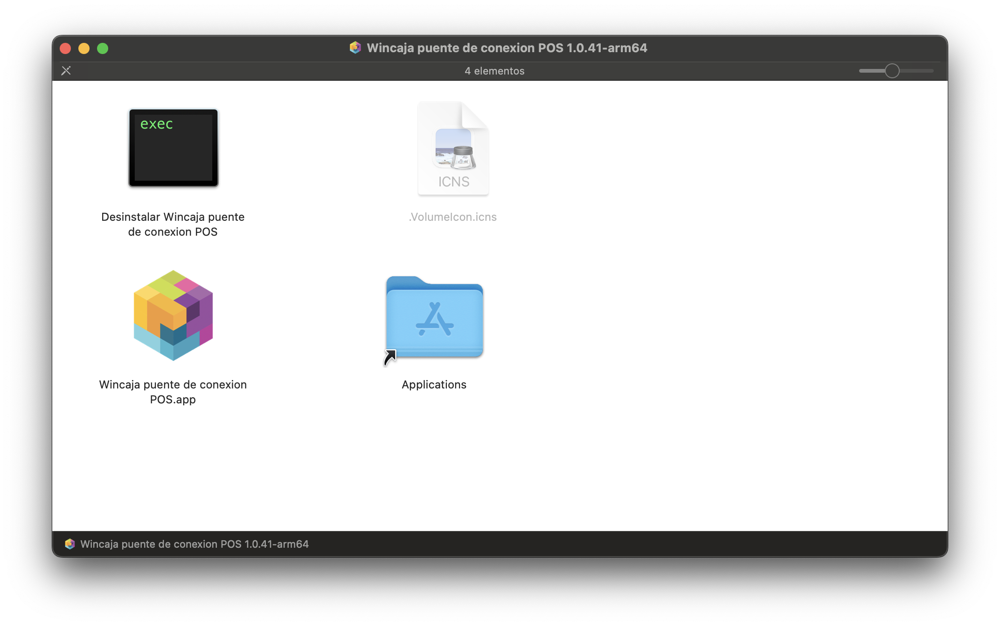

### Si macOS bloquea la aplicación

macOS puede mostrar una advertencia al abrir aplicaciones descargadas desde Internet. Si esto ocurre:

Referencia oficial de Apple sobre Gatekeeper:
[Gatekeeper y la protección en tiempo de ejecución en macOS](https://support.apple.com/es-mx/guide/security/sec5599b66df/web)

#### Autorizar desde Ajustes del Sistema

1. Intente abrir la aplicación.
2. Cuando aparezca el mensaje de bloqueo, haga clic en `OK`.
3. Abra `Ajustes del Sistema`.
4. Entre a `Privacidad y seguridad`.
5. Desplácese hasta la sección `Seguridad`.
6. Busque el mensaje de la aplicación bloqueada.
7. Haga clic en `Abrir de todos modos`.
8. Confirme con su contraseña o con `Touch ID`.

  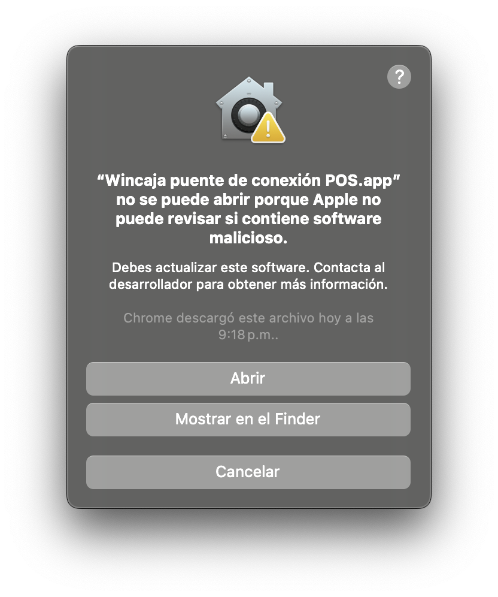

    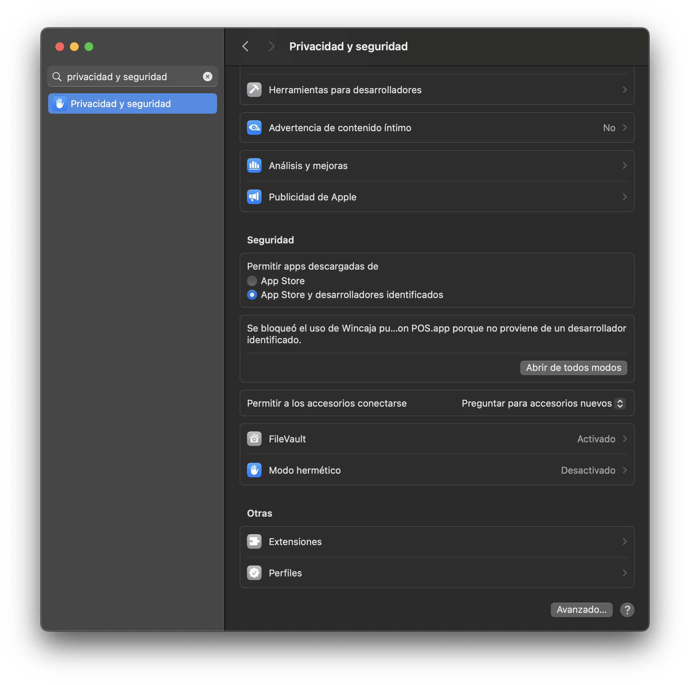

### Permitir conexiones entrantes en el firewall de macOS

Después de instalar y abrir la aplicación, macOS puede mostrar una alerta para permitir conexiones de red entrantes. Esto es esperado cuando la aplicación necesita recibir conexiones locales para operar correctamente.

Referencia oficial de Apple sobre el firewall de macOS:
[Cambiar la configuración de Firewall en la Mac](https://support.apple.com/es-mx/guide/mac-help/mh11783/mac)

Si aparece una alerta como la mostrada en las capturas, seleccione `Permitir`.

  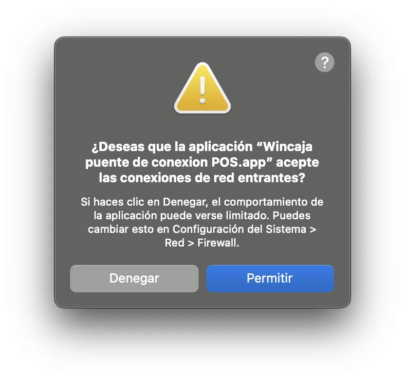

Si desea confirmar que el permiso quedó aplicado correctamente:

1. Abra `Ajustes del Sistema`.
2. Entre a `Red`.
3. Abra `Firewall`.
4. Haga clic en `Opciones`.
5. Busque la aplicación principal y el helper en la lista.
6. Verifique que ambos estén configurados como `Permitir las conexiones entrantes`.

    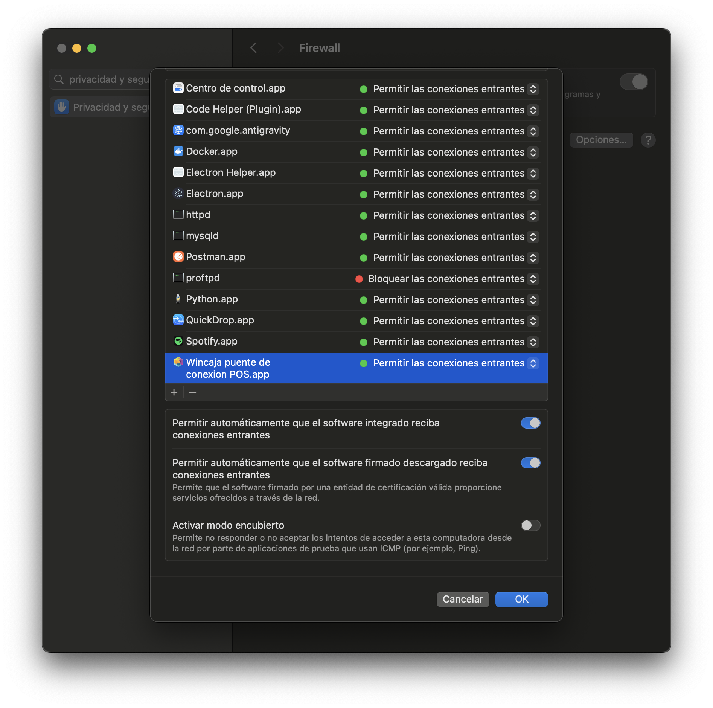

Si el permiso se rechazó por error:

1. Vaya a `Ajustes del Sistema > Red > Firewall > Opciones`.
2. Ubique la aplicación en la lista.
3. Cambie la regla a `Permitir las conexiones entrantes`.
4. Cierre y vuelva a abrir la aplicación.

### Instalación en Linux

1. Descargue el instalador o paquete entregado para su distribución.
2. Abra o ejecute el archivo según el formato proporcionado.
3. Complete el proceso de instalación.
4. Abra `Wincaja puente de conexión POS`.

### Permitir conexiones entrantes en el firewall de Linux

En Linux, algunas distribuciones pueden solicitar autorización en el firewall o requerir una regla manual para permitir conexiones entrantes de la aplicación.

Si su distribución muestra una alerta del firewall, permita el acceso para `Wincaja puente de conexión POS`.

Si la regla debe agregarse manualmente, solicite apoyo al área técnica para permitir las conexiones entrantes de la aplicación dentro del firewall de su distribución.

## Primer uso

Al abrir la aplicación por primera vez, deberá capturar los datos de conexión a la base de datos local.

La aplicación permite configurar:

- `Modo de conexión`
- `Instancia`
- `Host`
- `Puerto`
- `Usuario`
- `Contraseña`
- `Nombre de la base de datos`
- `Recuperar conexión`
- `URL del Verificador de Precios`

## Configuración de la aplicación

### Cómo abrir la configuración

1. Abra `Wincaja puente de conexión POS`.
2. Ubique el botón `Configuración de la app`.
3. Haga clic para abrir el panel de configuración.

### Opciones disponibles

#### Comportamiento

En esta sección puede ajustar cómo responde la aplicación al iniciar y al cerrarse.

- `Lanzar aplicación al iniciar`:
  Permite que la aplicación se abra automáticamente al iniciar sesión en el sistema operativo.
- `Confirmar salida de la aplicación`:
  Muestra una confirmación antes de cerrar completamente la aplicación, para evitar detener por accidente la conexión con la base de datos y los servicios locales.

#### Apariencia y accesibilidad

En esta sección puede adaptar la apariencia visual de la aplicación.

- `Tema visual`:
  Permite cambiar el estilo visual de la interfaz.
- `Reducir movimiento`:
  Disminuye animaciones y transiciones para una experiencia visual más estable.

#### Funciones auxiliares

En esta sección puede activar herramientas adicionales de apoyo.

- `Habilitar regeneración de QR`:
  Permite mostrar y regenerar el `QR de conexión` cuando cambie la `URL para conexión del servidor`.

### Recomendaciones de uso

- Use `Lanzar aplicación al iniciar` si necesita que el servicio esté disponible automáticamente al encender el equipo.
- Mantenga habilitada `Confirmar salida de la aplicación` para evitar cierres accidentales.
- `Reducir movimiento` puede ser útil si el equipo no tiene altas prestaciones para mostrar animaciones.
- Si comparte la conexión con otros dispositivos, conviene mantener habilitada la regeneración del `QR de conexión`.

## Configuración de la base de datos

La aplicación está preparada para conectarse a la Base de Datos de `Wincaja®`.

### Opción 1: Conexión por Instancia

Use esta opción cuando su servidor SQL Server se conecta por nombre de instancia.

#### Cómo llenar el formulario

1. En `Modo de conexión`, seleccione `Instancia`.
2. En `Instancia`, escriba el valor con formato `Servidor\Instancia`.
3. Capture el `Usuario`.
4. Capture la `Contraseña`.
5. Capture el `Nombre de la base de datos`.
6. Compruebe la conexión.

Ejemplos:

- `EQUIPO-CAJA\SQLEXPRESS`
- `SERVIDOR01\WINCAJA`
- `localhost\SQLEXPRESS`

  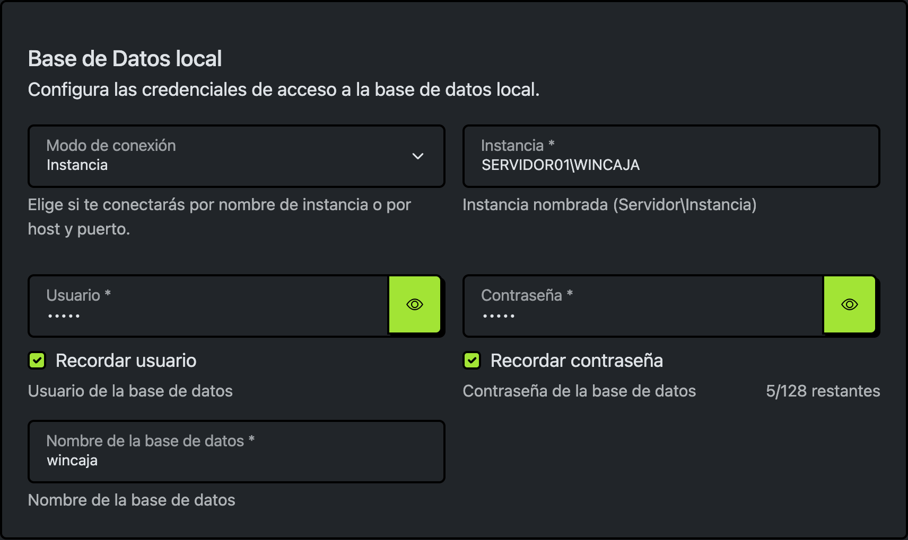

### Cómo identificar la instancia de SQL Server

#### Opción 1: Desde SQL Server Configuration Manager

1. Abra `SQL Server Configuration Manager`.
2. Entre a `SQL Server Services`.
3. Busque un servicio con nombre `SQL Server (<instancia>)`.
4. El texto entre paréntesis corresponde al nombre de la instancia.

Ejemplo:

- Si aparece `SQL Server (SQLEXPRESS)`, la instancia es `SQLEXPRESS`.
- Si el nombre del equipo es `CAJA01`, normalmente capturará `CAJA01\SQLEXPRESS`.

#### Opción 2: Desde Servicios de Windows

1. Abra `services.msc`.
2. Busque los servicios llamados `SQL Server (...)`.
3. Identifique el nombre entre paréntesis.

#### Opción 3: Con apoyo del área técnica

Si no conoce la configuración actual, solicite estos datos al área técnica:

- Nombre del servidor
- Nombre de la instancia
- Nombre exacto de la base de datos
- Usuario
- Contraseña

### Opción 2: Conexión por Host + Puerto

Use esta opción cuando conoce la dirección del servidor y el puerto TCP de SQL Server.

#### Cómo llenar el formulario

1. En `Modo de conexión`, seleccione `Host + Puerto`.
2. En `Host`, escriba el nombre del servidor o la dirección IP.
3. En `Puerto`, capture el puerto de SQL Server.
4. Capture el `Usuario`.
5. Capture la `Contraseña`.
6. Capture el `Nombre de la base de datos`.
7. Compruebe la conexión.

Ejemplos de host:

- `localhost`
- `192.168.1.20`
- `sqlserver-sucursal`

Puerto habitual:

- `1433`

Se recomienda usar esta opción cuando:

- El servidor está en otra máquina de la red.
- SQL Server usa conexiones TCP/IP.
- El área técnica le proporcionó host y puerto.

  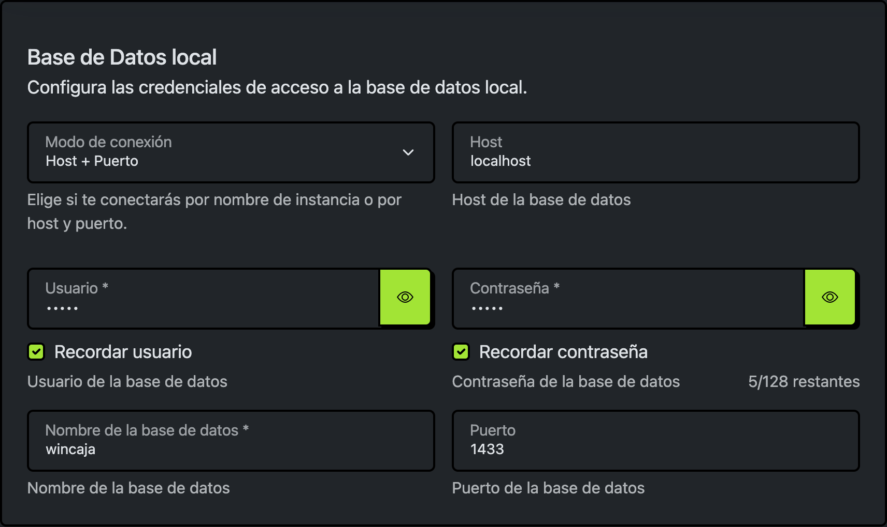

### Recomendaciones

- Verifique que el nombre de la base de datos esté escrito exactamente como existe en SQL Server.
- Si usa `Host + Puerto`, confirme que SQL Server tenga habilitado `TCP/IP`.
- Si la conexión falla, revise usuario, contraseña, host, instancia, puerto y permisos de red.
- Cuando sea posible, use un usuario dedicado para esta aplicación **(recomendado)**.

## Emparejar con el software Verificador de Precios usando el Asistente

Una vez que la aplicación esté abierta y conectada, podrá generar la liga de acceso para el Verificador de Precios.

  

### Paso 1: Verificar la URL para conexión del servidor

Confirme que la aplicación ya muestre la `URL para conexión del servidor`.

  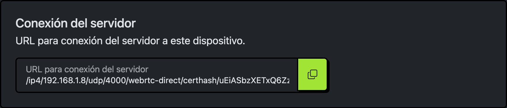

### Paso 2: Abrir el Asistente de URL de acceso

1. Dentro de la aplicación, ubique la sección de acceso.
2. Haga clic en `Asistente de URL de acceso`.
3. Se abrirá una ventana para capturar la `URL del Verificador de Precios`.

  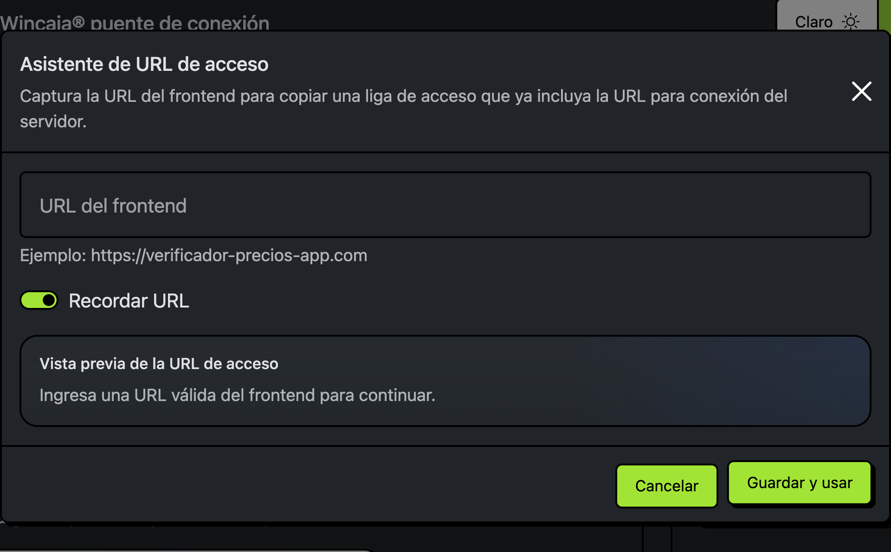

### Paso 3: Capturar correctamente la URL del Verificador de Precios

En el campo `URL del Verificador de Precios`, capture únicamente la dirección base del sistema web.

Ejemplos válidos:

- `https://verificador-precios-app.com/`
- `http://192.168.1.50:8080/`
- `http://localhost:4200/`

Reglas importantes:

- Debe iniciar con `http://` o `https://`.
- Debe incluir un host válido.
- No debe incluir parámetros.
- No debe incluir fragmentos.
- No debe incluir rutas adicionales.

### Paso 4: Guardar y usar la liga de acceso

1. Revise la `Vista previa de la URL de acceso`.
2. Si la vista previa es correcta, haga clic en `Guardar y usar`.
3. Una vez registrada la URL, se habilitarán los botones `Copiar` y `Abrir`.
4. Use `Copiar` para copiar la liga al portapapeles.
5. Use `Abrir` para abrir la liga en el navegador predeterminado.
6. Mediante la URL generada ya podrá acceder al **software Verificador de Precios emparejado a su punto de venta**.

  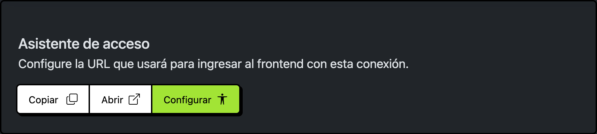

## Emparejar con el software Verificador de Precios usando el QR

También puede emparejar Verificador de Precios usando el `QR de conexión` que genera la aplicación.

### Paso 1: Verificar que el QR esté disponible

1. Confirme que la aplicación ya muestre la `URL para conexión del servidor`.
2. Ubique la sección `QR de conexión`.
3. Espere a que la aplicación genere el código QR correspondiente.

### Paso 2: Exportar el QR

1. Dentro de la sección `QR de conexión`, haga clic en `Exportar QR`.
2. Guarde la imagen en una ubicación fácil de encontrar.

### Paso 3: Abrir la conexión rápida en Verificador de Precios

1. Abra el software `Verificador de Precios`.
2. Vaya a la sección `Conexión rápida`.
3. Elija una de las opciones disponibles para leer el QR.

  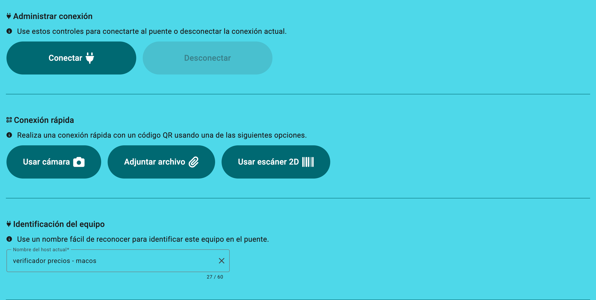

### Paso 4: Emparejar usando el QR

Puede usar cualquiera de estas opciones:

- `Usar cámara`:
  Permite escanear el QR directamente con la cámara del dispositivo.
- `Adjuntar archivo`:
  Permite seleccionar la imagen exportada del QR desde el equipo.
- `Usar escáner 2D`:
  Permite leer el QR con un escáner compatible.

### Paso 5: Confirmar la conexión

1. Verifique que Verificador de Precios cargue correctamente la `URL para conexión del servidor`.
2. Revise que la URL corresponda al equipo correcto.
3. Si el QR se importó o se escaneó correctamente, la conexión se establecerá de manera automática.
4. Espere la confirmación de emparejamiento.

  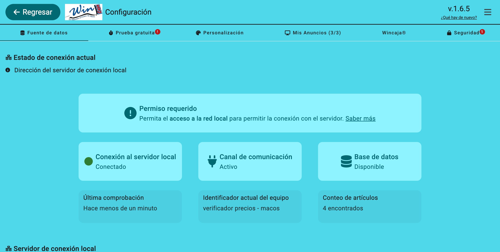

### Recomendaciones

- Si no se reconoce el QR, exporte nuevamente la imagen y repita el proceso.
- Si usa `Adjuntar archivo`, asegúrese de seleccionar el QR más reciente.
- Si la conexión no se completa, confirme que la aplicación siga abierta y que la `URL para conexión del servidor` continúe disponible.

## Solución de problemas

Si la aplicación no funciona como esperaba, revise estos casos comunes:

### La aplicación no conecta a la Base de Datos

- Verifique que el `Usuario`, la `Contraseña` y el `Nombre de la base de datos` sean correctos.
- Revise que la Base de Datos a la que se está conectando sea la del punto de venta `Wincaja®`.
- Si usa `Instancia`, confirme que el nombre esté escrito con el formato correcto `Servidor\Instancia`.
- Si usa `Host + Puerto`, confirme que el `Host` y el `Puerto` sean correctos.
- Verifique que el servicio de SQL Server esté en ejecución.
- Si usa `Host + Puerto`, confirme que SQL Server tenga habilitado `TCP/IP`.

### No aparece la URL para conexión del servidor

- Confirme que la aplicación siga abierta.
- Revise que la conexión con la base de datos se haya completado correctamente.
- Si hubo cambios recientes en la red o en la configuración, cierre y vuelva a abrir la aplicación.
- Verifique que el firewall haya permitido las `conexiones entrantes`.

### El Verificador de Precios no se empareja

- Revise que la `URL para conexión del servidor` corresponda al equipo correcto.
- Si usa el asistente, confirme que la `URL del Verificador de Precios` esté bien escrita.
- Si usa QR, vuelva a exportar la imagen e inténtelo nuevamente.
- Confirme que la aplicación de escritorio siga abierta al momento de emparejar.

### El QR no se reconoce

- Genere nuevamente el QR desde la aplicación.
- Si usa `Adjuntar archivo`, asegúrese de seleccionar la imagen correcta.
- Si usa cámara o escáner, procure que el código QR esté nítido y completamente visible.

## Desinstalación

### Desinstalación en macOS

El instalador de macOS incluye un script de desinstalación.

Para usarlo:

1. Abra el instalador `.dmg`.
2. Ubique el script de desinstalación incluido en la ventana del instalador.
3. Ejecute el script.
4. Confirme la desinstalación cuando el sistema lo solicite.

Este proceso elimina la aplicación y sus datos locales del equipo.

### Desinstalación en Windows

Para desinstalar la aplicación en Windows:

1. Abra `Configuración`.
2. Entre a `Aplicaciones`.
3. Busque `Wincaja puente de conexión POS`.
4. Haga clic en `Desinstalar`.
5. Siga los pasos del asistente.

## Compatibilidad con Microsoft SQL Server

La aplicación es compatible con las siguientes versiones de Microsoft SQL Server:

| Versión | Estado |
| --- | --- |
| SQL Server 2025 (17.x) | ✅ |
| SQL Server 2022 (16.x) | ✅ |
| SQL Server 2019 (15.x) | ✅ |
| SQL Server 2017 (14.x) | ✅ |
| SQL Server 2016 (13.x) | ✅ |
<!-- | SQL Server 2014 (12.x) | No soportado |
| SQL Server 2012 (11.x) | No soportado |
| SQL Server 2008 R2 o anteriores | No soportado | -->
